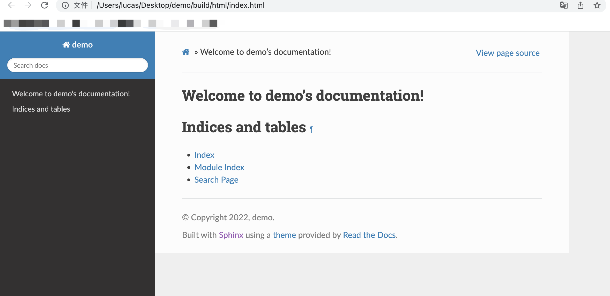

## 安装    
依赖`python`，我一般使用`python3`  
```bash
pip3 install -U Sphinx
```

## 快速使用  

### 创建项目  
提供了一个命令进行项目创建`sphinx-quickstart`，参考[quickstart](https://www.sphinx-doc.org/en/master/usage/quickstart.html)  

```bash  
$ sphinx-quickstart demo
$ tree demo
# 目录结构如下
demo
|-- Makefile
|-- build
|-- make.bat
`-- source
    |-- _static
    |-- _templates
    |-- conf.py
    `-- index.rst
```  

### 主题设置  
官方自带一些主题，可以到[官方文档](https://www.sphinx-doc.org/en/master/usage/theming.html)查阅。  
这里使用`sphinx_rtd_theme`，使用下面的命令进行安装  
```bash
pip3 install sphinx_rtd_theme
vi demo/source/conf.py
# 修改html_theme，并添加html_theme_path
html_theme = 'sphinx_rtd_theme'
html_theme_path = [sphinx_rtd_theme.get_html_theme_path()]
```
### 构建  
```bash
cd demo
make html
tree build -L 2
###
build
├── doctrees
│   ├── environment.pickle
│   └── index.doctree
└── html
    ├── _sources
    ├── _static
    ├── genindex.html
    ├── index.html
    ├── objects.inv
    ├── search.html
    └── searchindex.js
```  
### 访问  
